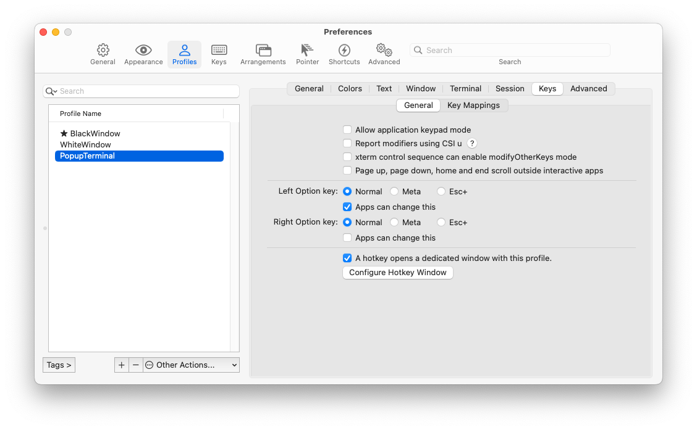
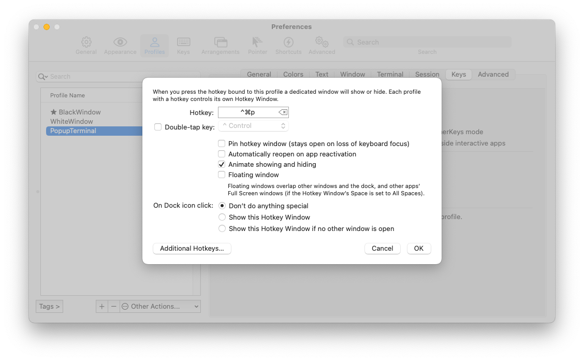
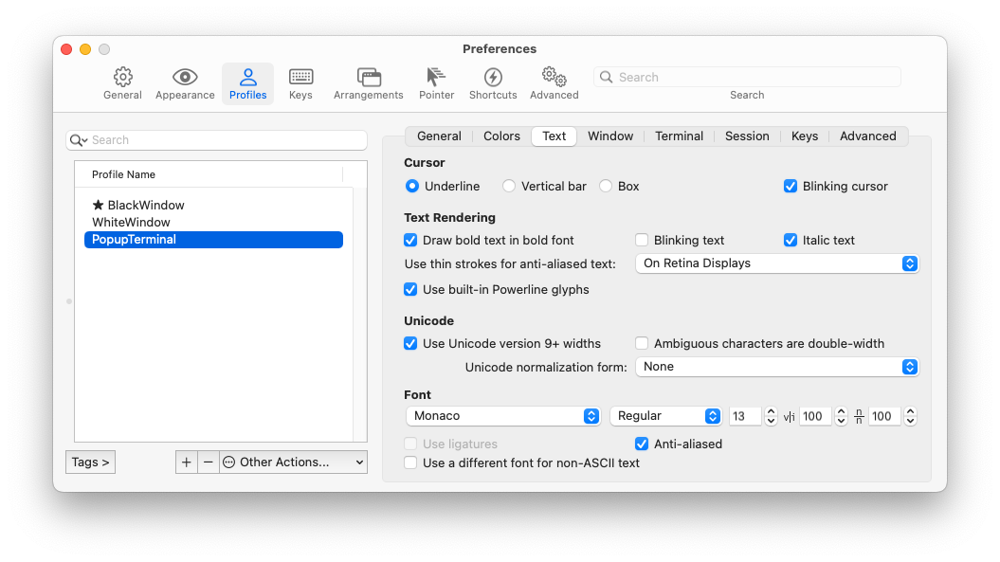
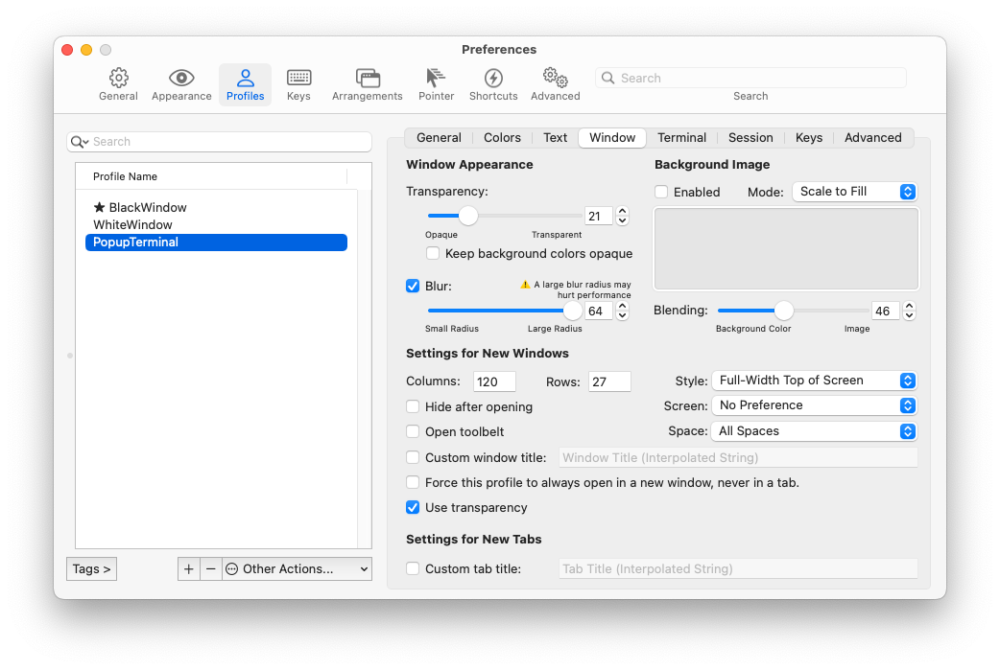
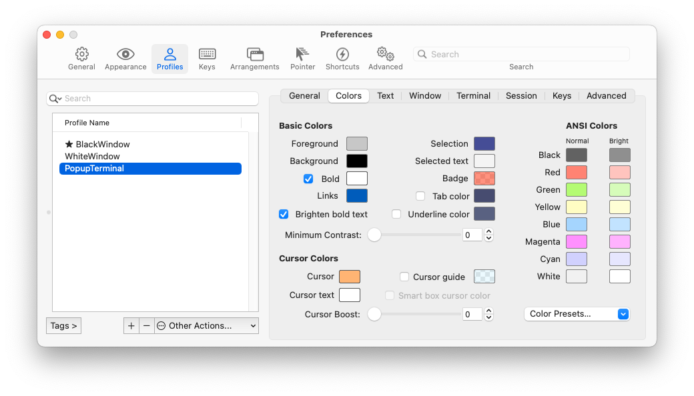

# Quake-iterm2

First step is to create a new profile for the popup terminal (for example via iterm2's preferences -> Profiles).

The configuration for the popup terminal is as follows:

In addition, to have this popup terminal available after boot, **ensure that iterm2 gets started after login**.

Optional, fyi:

